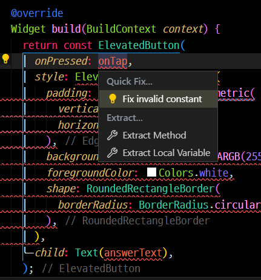

# Dart Invalid Constant Quick Fix

This extension provides a quick fix for invalid constant errors in Dart code within Visual Studio Code.

## Features

-   Automatically detects invalid constant errors in Dart code.
-   Provides a quick fix to remove the `const` keyword from the invalid constant declaration.
-   Supports both single quick fixes and source-wide fix-all actions.

## Usage

1. Open a Dart file in Visual Studio Code.
2. If there are any invalid constant errors, a lightbulb icon will appear next to the problematic code.
3. Click on the lightbulb icon and select "Fix invalid constant" to apply the quick fix.
4. To apply the fix to all invalid constants in the source code, click on the lightbulb icon and select "Fix all invalid constants in the source".

## Installation

Download and install this extension from the Visual Studio Code marketplace.
